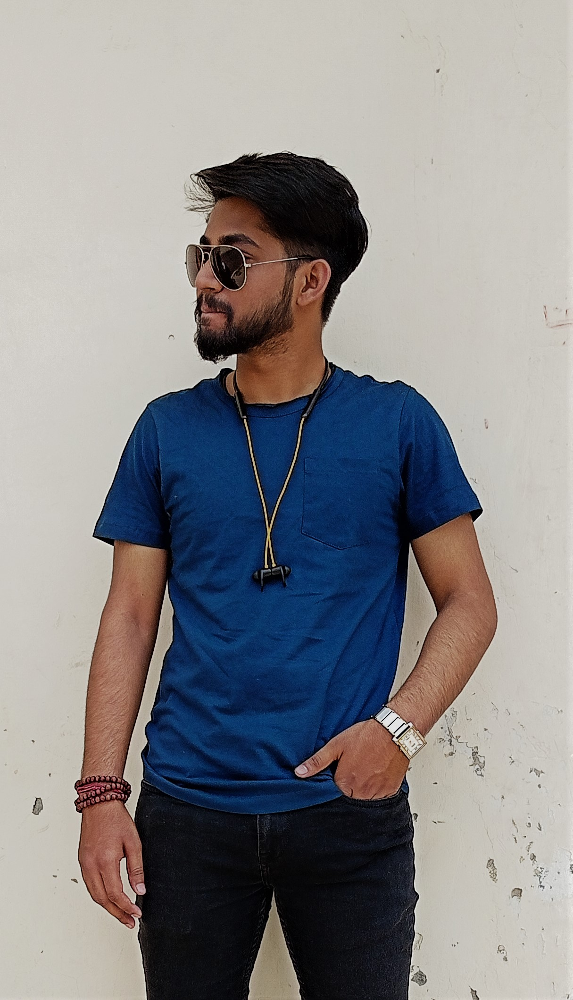

## Hey , I'm YASH KUMAR PAL  
## Little about myself  

<!-- Basic Introduction -->
- 🔭 I’m currently working on my skills & Networking with people
- 🌱 Learning Full Stack Development.
- 📫 How to reach me: palyashkumar@gmail.com 
- ⚡ A person who never made a mistake never tried anything. 
### Get In Touch 📞  
 
 
### Languages and Tools 

 
 

    
